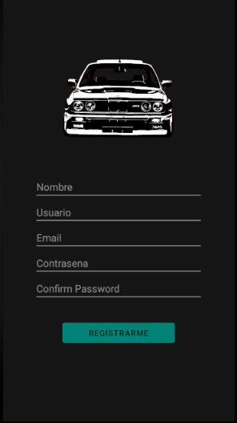
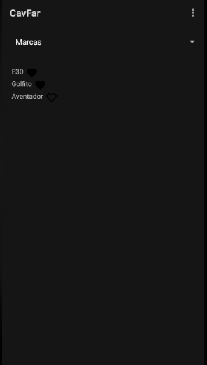
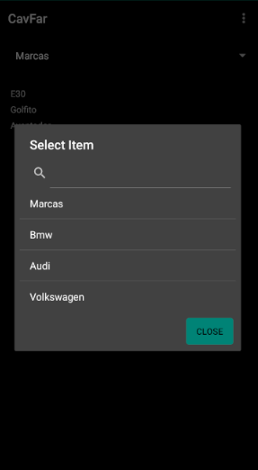
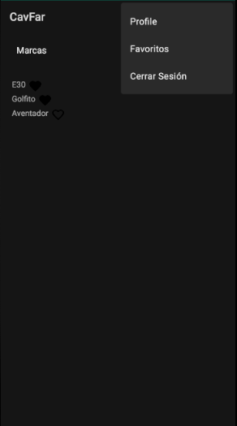
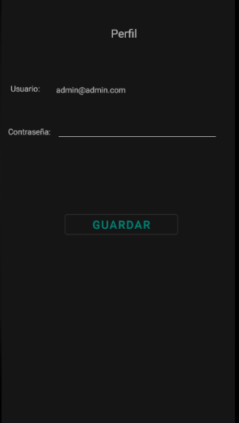
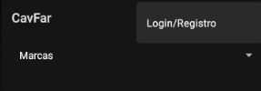

#CavFar

Para comenzar veremos la pantalla de Login 

Si no estamos registrados podemos hacerlo en esta ventana 

Vemos la pantalla principal de la aplicación 

Ahora veremos como es el buscador 

Continuamos y mostramos el menu de los registrados 

Vemos la pantalla donde editar la contraseña del usuario 

Si entramos como invitados en el login este será nuestro menu 

